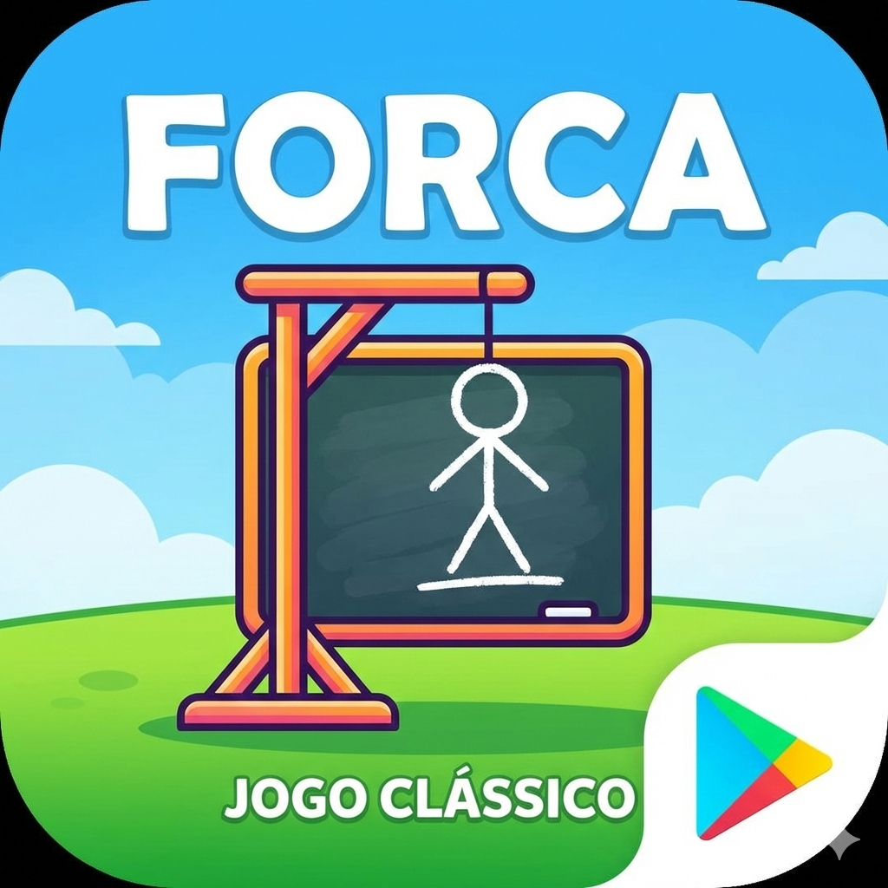
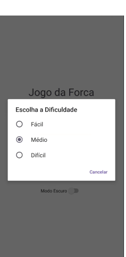
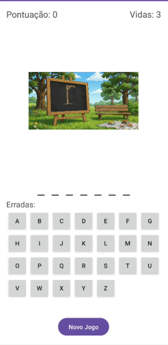
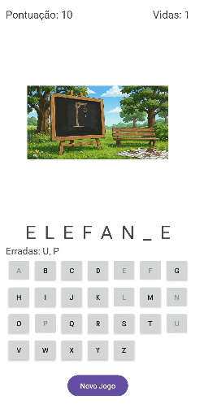
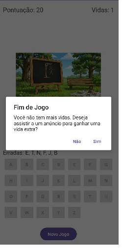
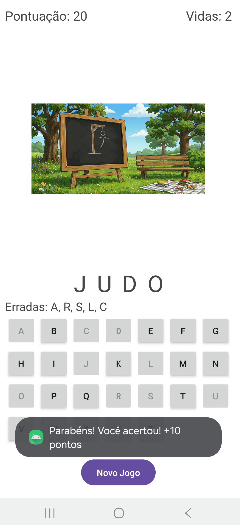

# 🎮 Jogo da Forca

Jogo desenvolvido em Android utilizando.

## 🚀 Sobre o jogo
Um jogo classicoda forca onde você precisa advinhar as palavras, senão já sabe, onde o jogador precisa superar e acertar as palavras cada uma com desafios se errar perde uma vida, para ganhar receba recompensas por nos ajudar e ver uma propaganda e divirta-se.

## 🕹️ Gameplay

  
  
  
  
  
  

## 🕹️ Mais Sobre o jogo
O jogador deve descobrir a palavra secreta antes que o boneco da forca
seja completado. O jogo conta com feedback visual simples e intuitivo.

## 📱 Plataforma
- Android

## 🛠️ Tecnologias
- Android Studio
- Kotlin / Java / Flutter / Unity

## 📦 Status
🚧 Em desenvolvimento / 🚀 Publicado na Play Store

## 🔐 Política de Privacidade
Veja em: [PRIVACY_POLICY.md](PRIVACY_POLICY.md)

## 📥 Download
Disponível em breve na Google Play Store.